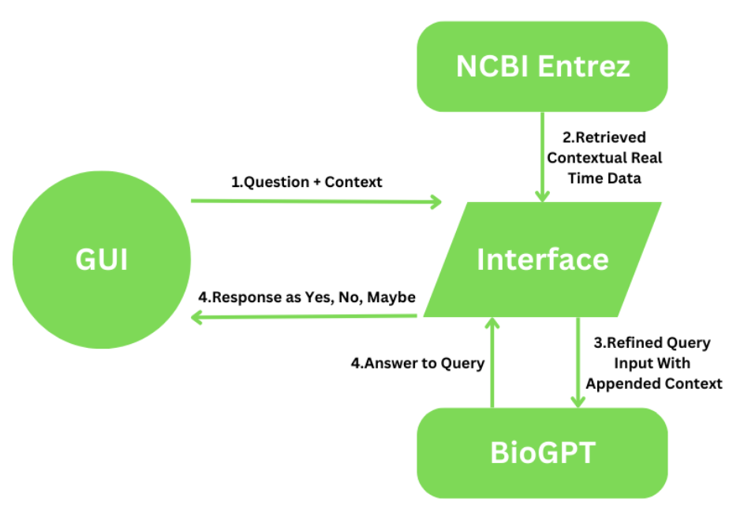
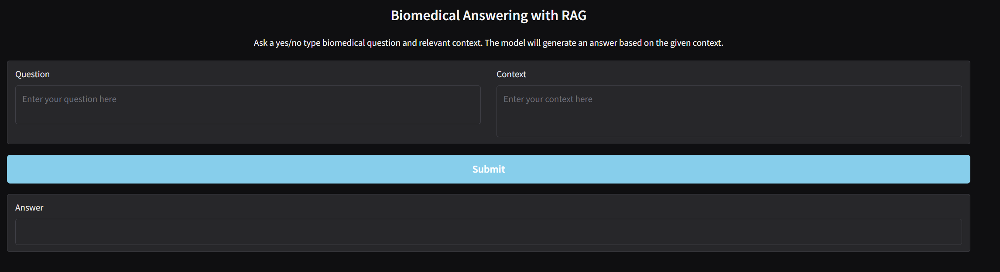
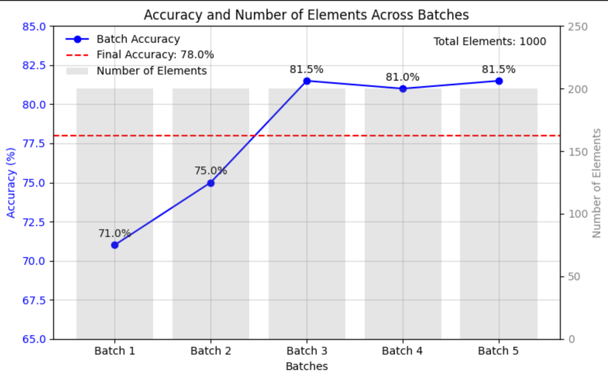

# Biomedical-RAG-LLM

This project integrates **BioGPT** with the **NCBI Entrez** database to develop a Retrieval-Augmented Generation (RAG) system for the biomedical domain. The system addresses the limitations of static pre-trained large language models (LLMs) by incorporating real-time data retrieval, significantly improving accuracy and relevance in biomedical question answering. Combines BioGPT's reasoning capabilities with dynamic, real-time data from NCBI Entrez.

## System Workflow:  
  1. **Question Loading**: Inputs from user interface.  
  2. **Context Retrieval**: Searches and retrieves relevant articles via NCBI Entrez API.  
  3. **Context Combination**: Merges retrieved and input context for enhanced query understanding.  
  4. **Answer Generation**: Fine-tuned BioGPT processes and generates accurate responses.

    
- **User Interface**: GUI for seamless question input and answer retrieval.

 

## Results  
- Batch-wise evaluations showed consistent accuracy improvements, with peak accuracy at **81.5%**.  
- Overall system accuracy: **78%**.

 

## References  

1. **PubMedQA**:  
   Jin, Q., Dhingra, B., Liu, Z., Cohen, W. W., & Lu, X. (2019). *PubMedQA: A Dataset for Biomedical Research Question Answering*. [arXiv:1909.06146](https://arxiv.org/abs/1909.06146).  

2. **BioGPT**:  
   Luo, R., et al. (2022). *BioGPT: Generative Pre-trained Transformer for Biomedical Text Generation and Mining*. Briefings in Bioinformatics, 23(6). [https://doi.org/10.1093/bib/bbac409](https://doi.org/10.1093/bib/bbac409).  

3. **NCBI Entrez**:  
   Sayers, E. W., et al. (2022). *Database Resources of the National Center for Biotechnology Information*. Nucleic Acids Research, 50(D1), D20–D26. [https://doi.org/10.1093/nar/gkab1112](https://doi.org/10.1093/nar/gkab1112).  

